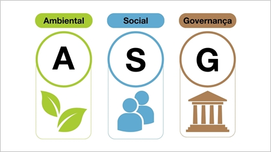

# Explicación de los tres pilares ASG

Las siglas ASG se refieren a los criterios utilizados para evaluar el desempeño de una empresa u organización en tres ámbitos clave de la sostenibilidad: “A” de ambiente, “S” de social y “G” de gobernanza

## ¿Qué tipo de acciones incluye el aspecto ambiental de un plan de sostenibilidad?

la minimización de emisiones de gases de efecto invernadero, la conservación de los recursos naturales, la gestión adecuada de residuos, entre otros

## ¿Por qué es importante la transparencia empresarial en la sostenibilidad?

La transparencia empresarial es más que una tendencia, es una necesidad en el mundo empresarial contemporáneo que beneficia tanto a las empresas como a la sociedad. Implementar prácticas transparentes mejora la reputación, fomenta una cultura de confianza y colaboración, y contribuye al desarrollo sostenible.

## ¿Qué implica el cumplimiento normativo en un plan de sostenibilidad?

El cumplimiento normativo en un plan de sostenibilidad implica que la empresa se adhiera a las leyes y regulaciones ambientales, sociales y de gobernanza. Esto asegura que sus operaciones respeten los estándares legales y éticos, minimizando riesgos y sanciones. También puede involucrar la implementación de medidas para cumplir con normativas locales e internacionales relacionadas con el medio ambiente, derechos laborales y prácticas de gobernanza, promoviendo la transparencia y la responsabilidad.
